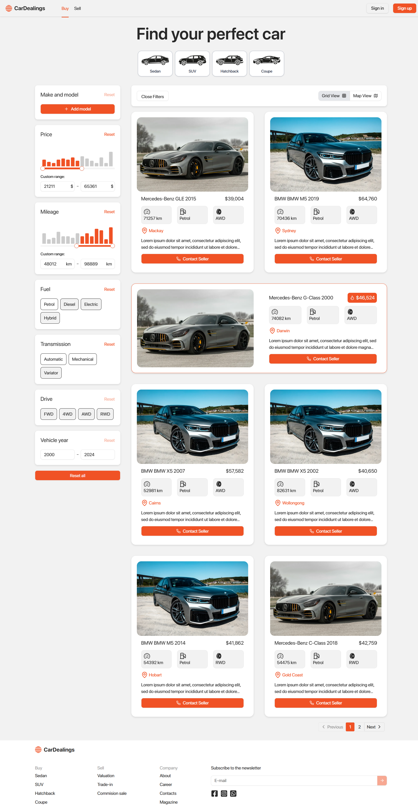
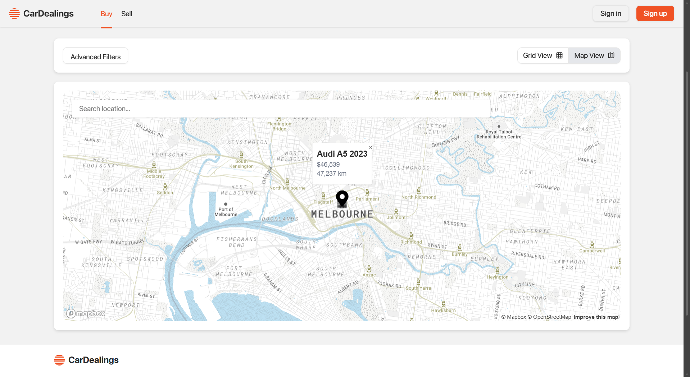
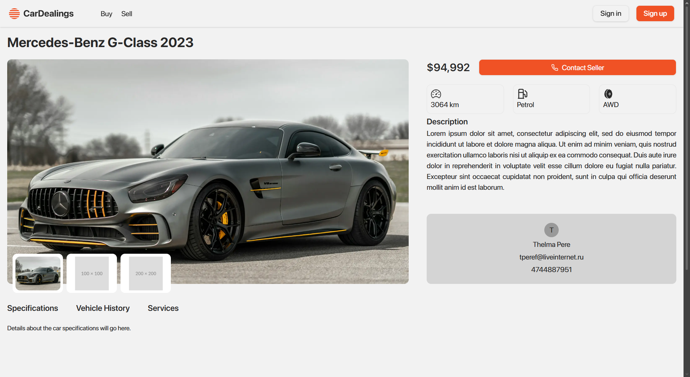
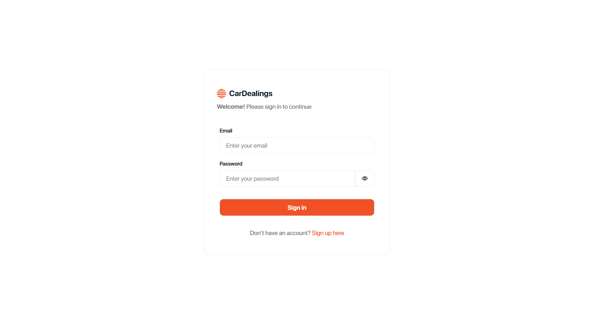

# 🚗 Car Dealer

<p align="center">
  A modern full-stack car dealership platform built with Next.js and Node.js.<br/>
  Browse, search, and explore car listings with a scalable production-ready architecture.
</p>

<p align="center">
  <b>Next.js • TypeScript • Express • Prisma • AWS Cognito</b>
</p>

---

## ✨ Overview

This project demonstrates a **real-world full-stack application** with a separated client/server architecture.

- ⚡ Modern frontend with Next.js
- 🔐 Secure authentication using AWS Cognito
- 🧠 Backend API with Express & Prisma
- ☁️ Cloud integration with AWS

---

## 🚀 Features

* 🔍 Browse and search car listings
* 🎯 Filter cars by different criteria
* 🚘 View detailed car information
* 🔐 User authentication with AWS Cognito
* 📱 Fully responsive design
* ⚡ Full-stack architecture (client + server)

---

## 📸 Screenshots

<p align="center">
  
</p>

<p align="center">
  <b>🏠 Home Page</b><br/>
  Clean UI showcasing featured vehicles and navigation
</p>

---

<p align="center">
  
</p>

<p align="center">
  
</p>

<p align="center">
  <b>🔍 Browse Cars</b><br/>
  Explore listings with filtering and search functionality
</p>

---

<p align="center">
  
</p>

<p align="center">
  <b>🚘 Car Details</b><br/>
  Detailed vehicle information with rich UI layout
</p>

---

<p align="center">
  
</p>

<p align="center">
  <b>🔐 Authentication</b><br/>
  Secure login and signup powered by AWS Cognito
</p>

---

<p align="center">
  
</p>

<p align="center">
  <b>📱 Responsive Design</b><br/>
  Optimized experience across devices
</p>

---

## 🧰 Tech Stack

### Frontend

- Next.js
- React
- TypeScript
- Tailwind CSS

### Backend

- Node.js
- Express
- Prisma ORM

### Cloud & Services

- AWS Cognito (Authentication)

---

## 📁 Project Structure

```
car-dealer/
├── client/   # Next.js frontend
└── server/   # Express backend
```

---

## 🚀 Getting Started

### 1. Clone the repo

```bash
git clone https://github.com/harryhan0401/car-dealer.git
cd car-dealer
```

---

## 🖥️ Client Setup

```bash
cd client
npm install
cp .env.example .env.local
npm run dev
```

Runs on: http://localhost:3000

---

## 🛠️ Server Setup

```bash
cd server
npm install
cp .env.example .env
npm run prisma:generate
npm run dev
```

Runs on: http://localhost:5001

---

## 🎨 UI Inspiration

Inspired by a car marketplace design from Dribbble.

* https://dribbble.com/shots/23769585-Used-Car-Marketplace-Design-Concept

Adapted into a functional full-stack application with a focus on clean layout and user experience.

---

## 🙏 Acknowledgments

* Design inspiration from Dribbble creators
* Open-source community and modern UI practices

---

## 👨‍💻 Author

**Huy Han**
GitHub: https://github.com/harryhan0401

---

## ⭐️ Show your support

If you like this project, give it a ⭐️ on GitHub!
